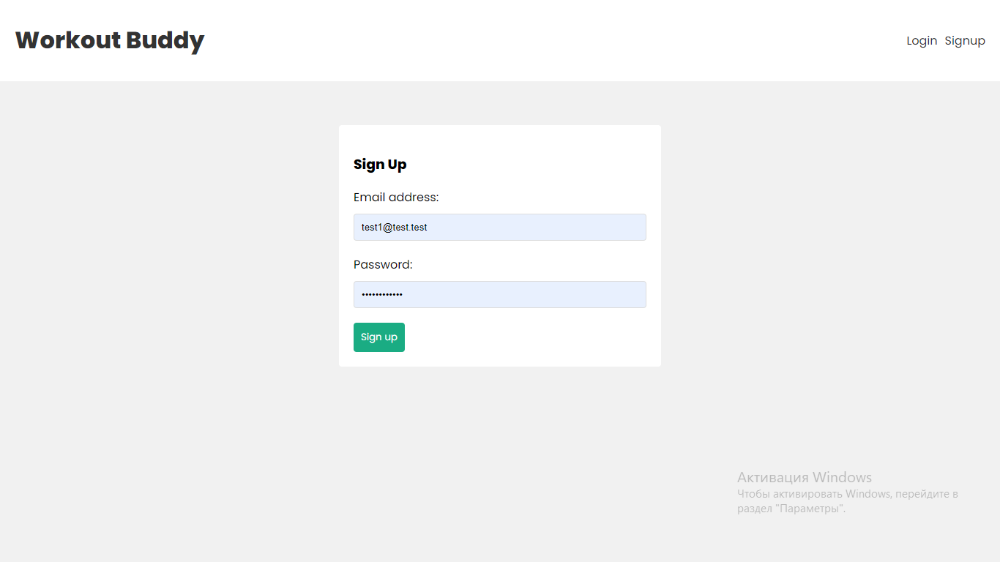
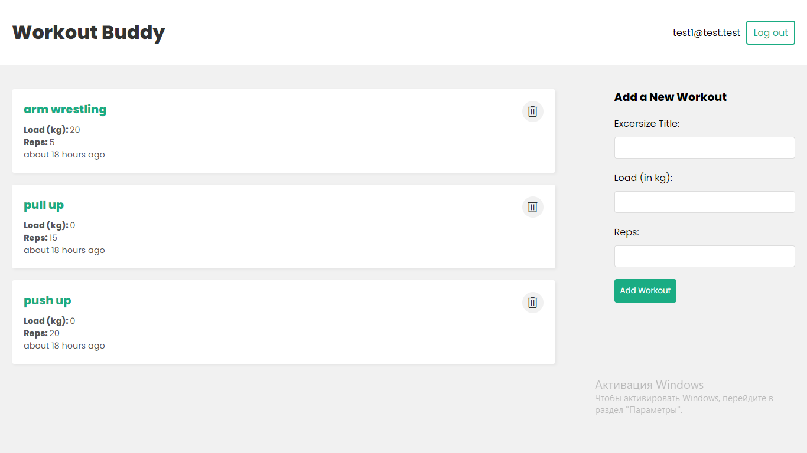
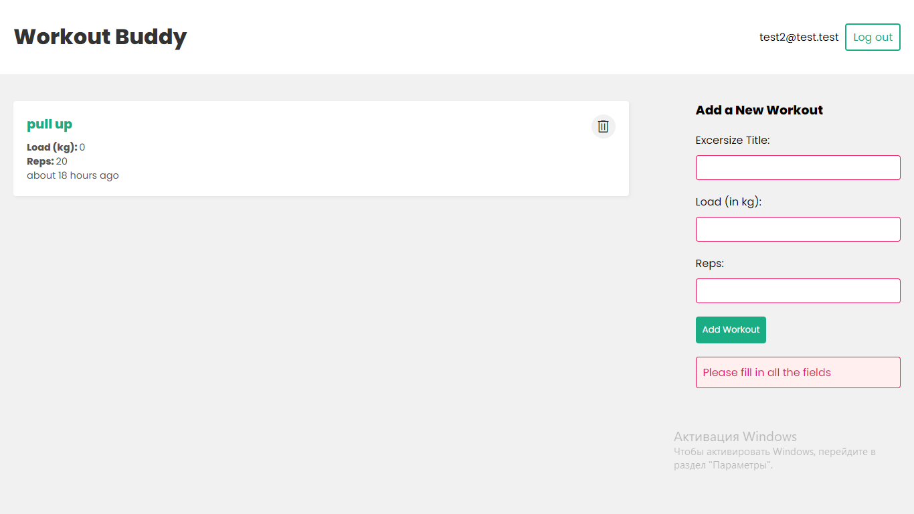
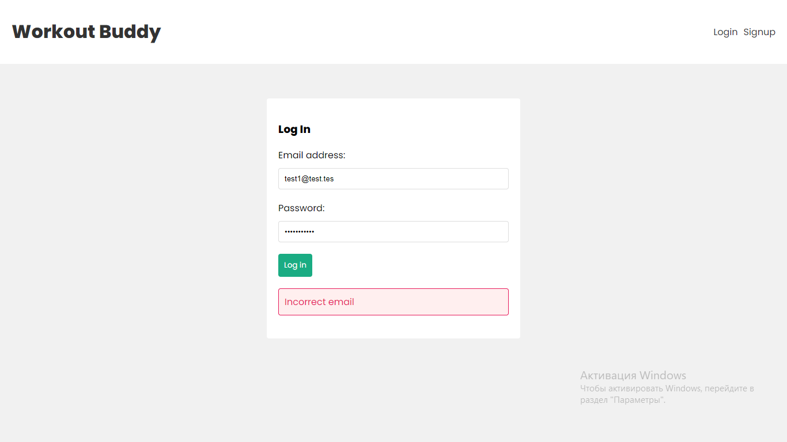
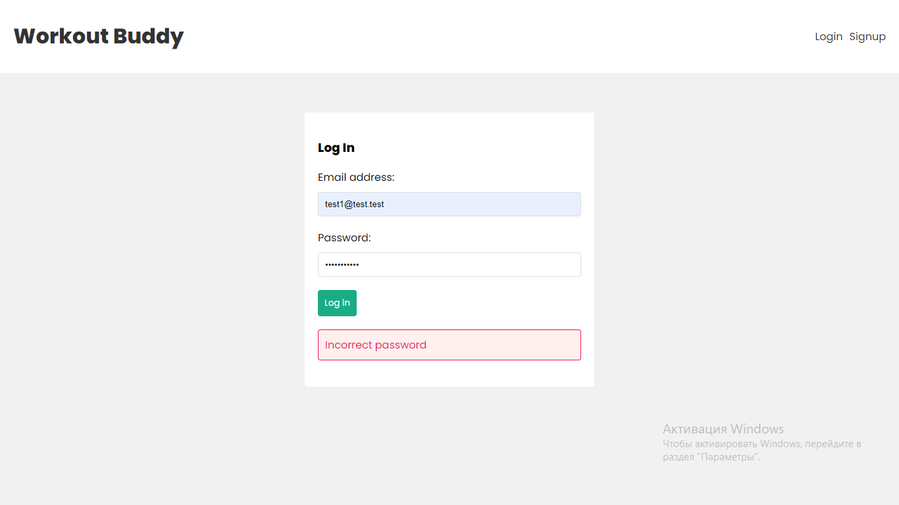

# MERN-withAuth

# sign up page

# Login page

# Home page

# Error with fields of Home page

# Errors diring signup and login

# description

The Workout Body web app is a MERN stack application that allows users to create and track their daily body workouts. The app provides a user-friendly interface where users can add their own email and write any kind of body workouts they perform on a daily basis. These workout notes are private and can only be seen by the user who created them.
